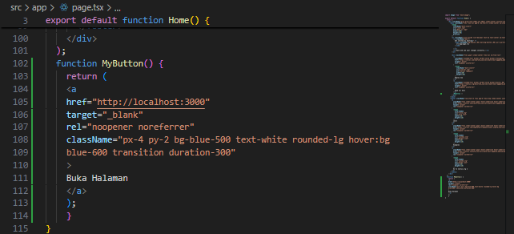

This is a [Next.js](https://nextjs.org/) project bootstrapped with [`create-next-app`](https://github.com/vercel/next.js/tree/canary/packages/create-next-app).

## Getting Started

First, run the development server:

```bash
npm run dev
# or
yarn dev
# or
pnpm dev
# or
bun dev
```

Open [http://localhost:3000](http://localhost:3000) with your browser to see the result.

You can start editing the page by modifying `app/page.tsx`. The page auto-updates as you edit the file.

This project uses [`next/font`](https://nextjs.org/docs/basic-features/font-optimization) to automatically optimize and load Inter, a custom Google Font.

## Laporan Praktikum

|  | Pemrograman Berbasis Framework 2024 |
|--|--|
| NIM |  2241720260|
| Nama |  Satria Abrar S.W.P |
| Kelas | TI - 3A |


### Praktikum 1: Menyiapkan Lingkungan Pengembangan

#### Pertanyaan Praktikum 1
1. Jelaskan kegunaan masing-masing dari Git, VS Code dan NodeJS yang telah Anda install 
pada sesi praktikum ini!

    <b>Jawaban:</b>

    - Git adalah sebuah sistem kontrol sumber daya yang digunakan untuk mengelola proyek software.
    - VS Code adalah sebuah perangkat lunak yang dapat digunakan untuk membangun aplikasi perangkat lunak, termasuk web, desktop, dan mobile.
    - NodeJS adalah sebuah interpreter yang digunakan untuk menjalankan kode JavaScript di sistem operasi Linux, Windows, dan macOS.

2. Buktikan dengan screenshoot yang menunjukkan bahwa masing-masing tools tersebut 
telah berhasil terinstall di perangkat Anda!

    <b>Jawaban:</b>

    

### Praktikum 2: Membuat Proyek Pertama React Menggunakan Next.js

1. Membuat folder proyek baru dengan nama `belajar-react`. Melalui konsol/command 
prompt/CMD masuk ke dalam folder tersebut dan jalankan perintah ini: 
`npx create-next-app`

    

2. Buat proyek baru dengan nama hello-world seperti di bawah ini. Nama proyek ini perlu 
dimasukkan pertama kali melalui konsol. 

    

3. Buka folder proyek hello-world menggunakan VS Code. Masuk ke dalam folder proyek hello world dengan perintah: `cd hello-world`. Kemudian setelah masuk ke folder hello-world, masukkan perintah: `code .`. Maka VS Code akan membuka project react Anda yang telah dibuat bernama hello-world. Dan akan menampilkan struktur folder proyek seperti di bawah ini.

    

4. Running proyek hello-world dengan memasukkan perintah di bawah ini melalui konsol atau terminal di dalam VS Code. `npm run dev` Tunggu proses kompilasi hingga selesai. Lalu Anda dapat membuka alamat localhost di browser: http://localhost:3000/

    
    

#### Pertanyaan Praktikum 2
1. Pada Langkah ke-2, setelah membuat proyek baru menggunakan Next.js, terdapat beberapa istilah yang muncul. Jelaskan istilah tersebut, TypeScript, ESLint, Tailwind CSS, App Router, Import alias, App router, dan Turbopack!

    <b>Jawaban:</b>

    - TypeScript adalah sebuah bahasa pemrograman yang digunakan untuk membangun aplikasi JavaScript dan TypeScript.
    - ESLint adalah sebuah alat untuk menguji kode JavaScript dan TypeScript untuk memastikan bahwa kode tersebut memenuhi standar yang diinginkan.
    - Tailwind CSS adalah sebuah framework CSS yang dapat digunakan untuk membangun sebuah website atau sebuah aplikasi web.
    - App Router adalah sebuah fitur yang digunakan untuk membuat sebuah aplikasi web yang dapat digunakan untuk membuat sebuah URL yang berbeda-beda untuk setiap halaman.
    - Import alias adalah sebuah fitur yang digunakan untuk mengimport sebuah modul dari sebuah file yang berbeda-beda.
    - Turbopack adalah sebuah fitur yang digunakan untuk mengoptimalkan sebuah proyek React untuk meningkatkan performa.

2. Apa saja kegunaak folder dan file yang ada pada struktur proyek React yang tampil pada gambar pada tahap percobaan ke-3!

    <b>Jawaban:</b>
    - .next adalah sebuah folder yang digunakan untuk menyimpan file-file yang dihasilkan oleh proses build aplikasi React.
    - node_modules adalah sebuah folder yang digunakan untuk menyimpan semua modul yang dibutuhkan oleh aplikasi React.
    - public adalah sebuah folder yang digunakan untuk menyimpan semua file-file yang dibutuhkan oleh aplikasi React.
    - src adalah sebuah folder yang digunakan untuk menyimpan semua file-file yang dibutuhkan oleh aplikasi React.
    - .gitignore adalah sebuah file yang digunakan untuk menentukan file-file yang tidak perlu di-commit ke dalam repositori.
    - eslint.config.js adalah sebuah file yang digunakan untuk menentukan standar linting untuk aplikasi React.
    - next-env.d.ts adalah sebuah file yang digunakan untuk menentukan tipe data yang dibutuhkan oleh aplikasi React.
    - next.config.js adalah sebuah file yang digunakan untuk menentukan konfigurasi aplikasi React.
    - package-lock.json adalah sebuah file yang digunakan untuk menentukan versi modul yang digunakan oleh aplikasi React.
    - package.json adalah sebuah file yang digunakan untuk menentukan informasi tentang aplikasi React.
    - postcss.config.js adalah sebuah file yang digunakan untuk menentukan konfigurasi PostCSS.
    - tailwind.config.js adalah sebuah file yang digunakan untuk menentukan konfigurasi Tailwind CSS.
    - tsconfig.json adalah sebuah file yang digunakan untuk menentukan tipe data dan konfigurasi TypeScript.

3. Buktikan dengan screenshoot yang menunjukkan bahwa tahapan percobaan di atas telah berhasil Anda lakukan! 

    <b>Jawaban:</b>

    

### Praktikum 3: Menambahkan Komponen React (Button) 

1. Di dalam folder proyek yang telah dibuka di VS Code, buka file page.tsx

2. Tambahkan fungsi MyButton yang mengembalikan markup komponen button yang akan ditambahkan ke dalam webpage

    

3. Tambahkan komponen button tersebut di samping button Read Our Docs.

    

    Perhatikan bahwa komponen MyButton dimulai dengan huruf kapital. Dengan cara itulah Anda mengetahui bahwa itu adalah sebuah komponen React. Nama komponen React harus selalu dimulai dengan huruf kapital, sedangkan tag HTML harus menggunakan huruf kecil. Kata kunci export default menentukan komponen utama di dalam berkas (file).

4. Simpan perubahan dan coba lihat perubahan melalui web browser!

#### Pertanyaan Praktikum 3

1. Buktikan dengan screenshoot yang menunjukkan bahwa tahapan percobaan di atas telah berhasil Anda lakukan!

    
    

### Praktikum 4: Menulis Markup dengan JSX

1. Tambahkan kode JSX di bawah ini ke dalam file page.tsx.

    

2. Tambahkan komponen MyProfile setelah kompnen MyButton. 

    

3. Simpan dan amati perubahan di halaman web yang dihasilkan!

#### Pertanyaan Praktikum 4

1. Untuk apakah kegunaan sintaks user.imageUrl?

    <b>Jawaban:</b>

    Sintaks user.imageUrl digunakan untuk mengambil nilai dari properti imageUrl yang ada di objek user.

2. Buktikan dengan screenshoot yang menunjukkan bahwa tahapan percobaan di atas telah berhasil Anda lakukan!

    <b>Jawaban:</b>

    
    
    